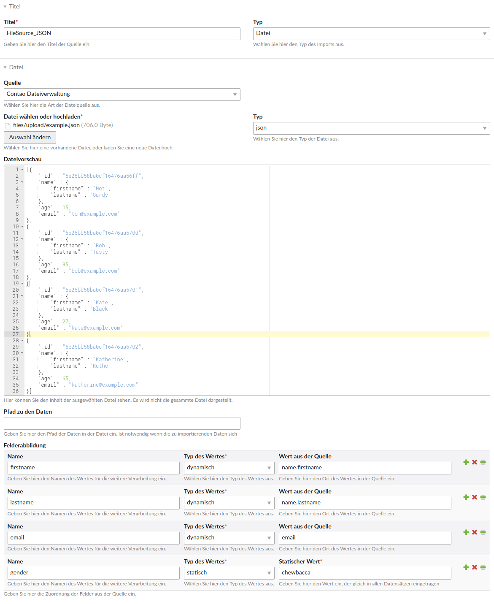
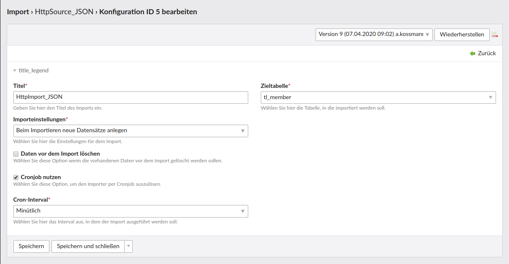
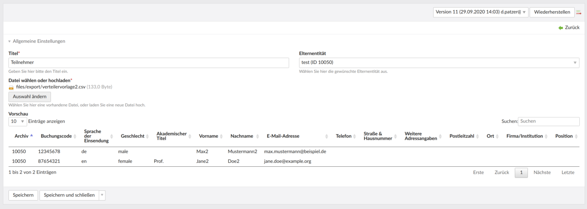

# Contao Entity Import Bundle

This bundle offers a generic importer to migrate data from various sources to contao database entities.

**This Bundle is still in development.**

## Features

- import data from either file content or database into arbitrary contao database entities (`tl_*`)
- support for various data types (json, csv, ...)
- support for various source types (contao file system, http, absolute path)
- executable from contao backend, as cronjob and symfony command
- automatic field manipulation (sorting, alias, dateAdded, tstamp)
- merge and insert mode
- email and contao_log notifications while executing import with exceptions (will be sent once per importer 
configuration, will be reset after next successful import)
- (optional) support for [DC_Multilingual](https://github.com/terminal42/contao-DC_Multilingual) if installed

## Impressions

Importer source backend settings:



Importer config backend settings:



## Installation

Install via composer: `composer require heimrichhannot/contao-entity-import-bundle` and update your database.

## Configuration

1. Navigate to "Import" in the Contao backend in the section "system".
1. Create an importer source to your needs.
1. Create an importer using the source created in the step before.
1. Run the importer either using dry-run or the normal mode.

### config.yml

```yaml
huh_entity_import:
  debug:
    contao_log: true # log errors while importing to contao system log
    email: false # report errors while importing via email to the admin email defined in the contao settings
```

## Technical instructions

### Run as symfony command

`huh:entity-import:execute config-ids [--dry-run]`

where `config-ids` needs to be a comma separated list of importer config IDs.

##### Arguments
Argument | Mandatory | Type | Description
--------|--------|-------|---
config-id | true | integer |The ID of the importer configuration
dry-run | false | boolean |Run importer without writing data into database

### Run as contao cron

Import is executable with contao poor man's cron. The interval of execution is similar to the contao definition.
The import configuration allows to enable cron execution and picking of the cron interval.
Possible to choose between `minutely`, `hourly`, `daily`, `weekly`, `monthly` interval. It is recommended to setup
the debug options in config.yml before importing via cronjob.

### Add custom sources

1. Create the source and extend from `\HeimrichHannot\EntityImportBundle\Source\AbstractSource` or implement the
   interface `\HeimrichHannot\EntityImportBundle\Source\SourceInterface`.
1. Create an event listener for the event `SourceFactoryCreateSourceEvent`:
   ```php
   class SourceFactoryCreateSourceEventListener {
       public function __invoke(SourceFactoryCreateSourceEvent $event) {
           $sourceModel = $event->getSourceModel();
           $source = $event->getSource();
   
           switch ($sourceModel->type) {
               case 'new_stuff':
                   $source = new NewStuffSource();
   
                   break;
               // ...
           }
   
           $event->setSource($source);
       }
   }
   ```
1. Create a `tl_entity_import_source.php` and add your sources in the `type` field's options:
   ```php
   $dca = &$GLOBALS['TL_DCA']['tl_entity_import_source'];
   
   $dca['fields']['type']['options'] = array_merge($dca['fields']['type']['options'], [
       'new_stuff'
   ]);
   ```
1. Create your palette in your `tl_entity_import_source.php`, e.g. by copying one from this bundle.

### Add presets for source/config field mapping

Adding a field mapping might be tedious sometimes. Hence we provide an event for adding presets which then are selectable in the backend entity (source and config).

Just register an event listener and add your presets the following way:

```
$presets = $event->getPresets();

$presets = array_merge($presets, [
    'twitter' => [
        [
            'name'        => 'externalId',
            'valueType'   => 'source_value',
            'sourceValue' => 'id',
        ],
        [
            'name'        => 'text',
            'valueType'   => 'source_value',
            'sourceValue' => 'full_text',
        ],
        [
            'name'        => 'publishedAt',
            'valueType'   => 'source_value',
            'sourceValue' => 'created_at',
        ],
        [
            'name'        => 'imageUrl',
            'valueType'   => 'source_value',
            'sourceValue' => 'image_url',
        ],
        [
            'name'        => 'imageId',
            'valueType'   => 'source_value',
            'sourceValue' => 'image_id',
        ],
        [
            'name'        => 'url',
            'valueType'   => 'source_value',
            'sourceValue' => 'url',
        ],
    ]
]);

$event->setPresets($presets);
```

### Add quick importers for editors

To be honest: A "quick importer" is a nicer term for "easy importer", so that editors don't get sad ;-) The use case for quick importers
is to have a user interface which is *way* easier to use for editors.

Simply create an import source and import config as you would normally. Afterwards editors can create quick importers on their own
and add custom file sources (currently only files of the type CSV are supported).



## Events

Name | Description
-----|------------
`AddConfigFieldMappingPresetsEvent` | Add config field mapping presets
`AddSourceFieldMappingPresetsEvent` | Add source field mapping presets
`AfterFileSourceGetContentEvent` | Configure the data after receiving from source
`AfterImportEvent` | Get imported data after finished import
`AfterItemImportEvent` | Get imported item data after finished import
`BeforeAuthenticationEvent` | Configure authentication data before sending GET request to http source
`BeforeImportEvent` | Configure the data before importing
`BeforeItemImportEvent` | Configure the item data before importing; call `setSkipped(true)` in order to skip the import
`SourceFactoryCreateSourceEvent` | Implement custom logic for new custom file sources
`BeforeFileImportEvent` | Implement a custom logic for setting the folder and/or file path when importing files
